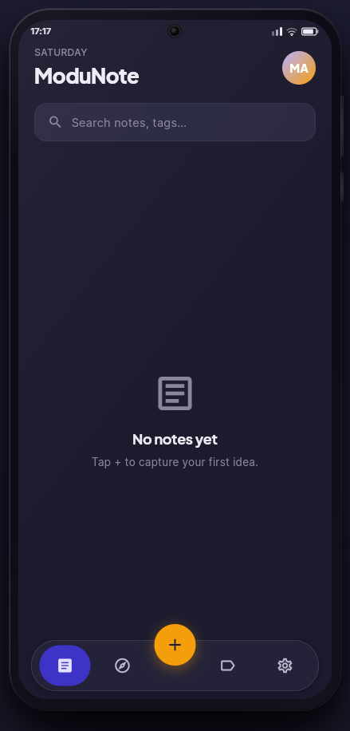

# ModuNote

**ModuNote** is an offline-first, AI-assisted note-taking app for a solo content creator who needs to capture ideas the moment they happen — open, tap the FAB, start typing, and the note saves itself. On top of fast local capture it adds an **AI writing assistant**, **"Ask your notes" retrieval-augmented QnA** over your own notes, **Google Sign-In**, and **durable cloud backup/restore** so nothing is lost across reinstalls.

Built with **Flutter** (strict **MVVM + Repository** architecture), a **Drift/SQLite** local database with **FTS5 full-text search**, **Riverpod 2** with full code generation, a **flutter_quill** Delta-JSON rich text editor, and **Firebase** (Google auth + Firestore sync). The AI features are served by a separate **FastAPI** backend — **Groq** LLM, **Jina** embeddings, **Supabase Postgres + pgvector** — deployed on Render, with per-user data isolation enforced by verifying Firebase ID tokens server-side.

This is a real, in-use app that also serves as a portfolio project: developed phase-by-phase with documented architectural decisions, automated tests on both the app and the backend, and a public web demo.

> **Live web demo →** [modunote-ba654.web.app](https://modunote-ba654.web.app) — a login-free Flutter Web build (Firebase Hosting) inside a phone-frame page, pre-loaded with demo notes so you can try the RAG **"Ask your notes"** feature without an account. See [Web Portfolio Preview](#web-portfolio-preview).

<p align="center">
  
</p>

---

## What it does

- **Capture notes instantly** — tap the amber FAB on the home screen, write a title, start typing in the rich text editor. The note auto-saves 800 ms after you stop typing. A small "Saved / Saving…" badge shows the live save state.
- **Rich text editing** — bold, italic, underline, H1, H2, bulleted lists, numbered lists, checklists, and blockquotes via a pinned formatting toolbar. Content is stored as Quill Delta JSON — portable and Firebase-ready.
- **Tags and categories** — each note can carry multiple freeform tags and belong to a hierarchical category (adjacency-list tree, max depth 5). Tags are stored in a normalised join table and as a denormalised JSON column on the note for O(1) ViewModel reads. The tag picker in the editor shows all existing tags on open for one-tap selection, with prefix search as you type. A filter chip bar on the home screen filters by category or tag; selecting a parent category includes notes from all descendant categories.
- **Full-text search** — a SQLite FTS5 virtual table (`notes_fts`) stays in sync via three SQLite triggers. The search screen debounces at 300 ms and streams results live.
- **AI writing assistant** — from the editor's ⋮ menu: Improve, Humanize, Paraphrase, Format-as-script, Critique, and Summarise — tag-aware, with Insert / Replace / Copy. An auto-suggest banner proposes tags for untagged notes. Runs on the backend (Groq LLM) and never blocks saving.
- **"Ask your notes" (RAG QnA)** — ask natural-language questions and get answers grounded **only in your own notes**, with citation chips that deep-link to the source note. Notes tagged with configurable scope tags are chunked, embedded (Jina, 768-dim), and stored in Supabase pgvector; a question runs cosine top-k retrieval → Groq for a grounded answer. Every query is scoped to the signed-in user (see [Accounts & security](#accounts--security)).
- **Voice memos** — a mic in the editor's voice panel records AAC audio (32 kbps, mono, 16 kHz) with a live amplitude waveform. Transcription uses on-device speech recognition first, falling back to a backend Whisper (Groq) transcription; the clip is always saved even if transcription is unavailable, and the transcript can be paraphrased or inserted into the note.
- **Swipe actions on note cards** — swipe left to archive, swipe right to toggle pin. Cards spring back after the action fires so the list updates without jarring dismissal animations. Long-press (or the ⋮ button in the editor) opens a contextual bottom sheet for pin, archive, or delete.
- **Archive screen** — accessible from Settings; lists all archived notes with swipe-right to restore or swipe-left to permanently delete (with confirmation).
- **Pinning** — pinned notes float to a separate "Pinned" section above the recent list; unpinning returns them to the recency order.
- **Theme** — light, dark, and system modes with a live preview tile picker in Settings. Mode persists across restarts via SharedPreferences.
- **Accounts + cloud sync** — sign in with Google (or continue as a guest); on sign-in your notes, tags, and full category hierarchy restore from Firestore, and changes back up on app-background — so data survives reinstalls and new devices. A profile avatar shows your Google photo with a sign-out sheet.
- **Offline-first** — the entire app works with zero network access. Local Drift/SQLite is the source of truth; cloud sync and the AI features layer on top via the repository/service interfaces, not as a dependency of the core capture experience.
- **Actionable AI errors** — when an AI call fails, the QnA screen names the failing source (provider error with the backend's detail, sign-in rejected, rate-limited, or server unreachable/waking) instead of a generic "unavailable".

---

## Architecture

The project follows a strict four-layer architecture. Each layer only knows about the layer directly below it.

```
View  →  ViewModel  →  Repository Interface  →  Data Source (Drift DAO)
```

**Views** are `ConsumerWidget` or `ConsumerStatefulWidget`. They watch ViewModel providers and call notifier methods. They never touch a repository or a DAO.

**ViewModels** are Riverpod `AsyncNotifier` or `Notifier` classes generated from `@riverpod` annotations. They hold UI state and call methods on repository *interfaces*. They never import `AppDatabase` or any Drift type.

**Repository interfaces** (`INoteRepository`, `ITagRepository`, `ICategoryRepository`) are abstract Dart classes. The local Drift implementations live in `data/repositories/local/`; the Firebase write layer and the `SyncedNoteRepository` wrapper swapped in behind the same interfaces without touching any ViewModel or View.

**Data sources** are Drift DAOs (`NotesDao`, `TagsDao`, `CategoriesDao`, `AudioRecordsDao`) registered on `AppDatabase`. They return typed streams and futures. Raw Drift/SQLite exceptions are caught here and re-thrown as `AppException` subtypes before reaching the ViewModel layer.

### Folder structure

```
lib/
├── core/
│   ├── constants/          # AppConstants — audio config, limits, string keys
│   ├── errors/             # Sealed AppException hierarchy (5 subtypes)
│   ├── extensions/         # StringExtensions — isBlank, normalised, truncate
│   ├── utils/              # UuidGenerator — wraps uuid package
│   └── theme/              # AppColors (34 tokens), AppTypography, AppTheme
│
├── data/
│   ├── models/             # Note, Tag, Category, AudioRecord — immutable + Equatable
│   ├── repositories/
│   │   ├── interfaces/     # INoteRepository, ITagRepository, ICategoryRepository
│   │   ├── local/          # Drift implementations
│   │   ├── remote/         # FirebaseNoteRepository (Firestore writes)
│   │   └── synced/         # SyncedNoteRepository — wraps local + remote
│   └── datasources/
│       ├── local/
│       │   ├── tables/     # 5 Drift table definitions
│       │   ├── daos/       # 4 DAOs (notes, tags, categories, audio records)
│       │   ├── converters/ # QuillDeltaConverter, DateTimeConverter, StringListConverter
│       │   ├── app_database.dart       # @DriftDatabase — 5 tables, FTS5, v2 migration
│       │   └── database_providers.dart # 6 keepAlive Riverpod providers
│       └── file/           # AudioFileStorage — create dir, generate path, delete
│
├── presentation/
│   ├── viewmodels/         # NoteListVM, NoteEditorVM, TagListVM, CategoryTreeVM,
│   │                       # SearchVM, ArchivedNotesVM, NoteFilterNotifier
│   ├── views/
│   │   ├── note_list/      # NoteListScreen — swipe cards, filter chip bar
│   │   ├── note_editor/    # NoteEditorScreen — Quill, voice, ⋮ options sheet
│   │   ├── search/         # SearchScreen
│   │   ├── tags/           # TagsScreen — density bars, tag management
│   │   ├── archive/        # ArchivedNotesScreen — restore / delete
│   │   └── settings/       # SettingsScreen — theme tiles, archive entry
│   ├── widgets/            # MNNoteCard, MNSearchField, MNEditorToolbar,
│   │                       # MNTagRow, MNCategoryPickerSheet, MNBottomNav
│   └── router/             # GoRouter ShellRoute, _AppShell, ThemeModeNotifier
│
└── services/
    ├── audio/              # AudioRecordingService — flutter_sound AAC wrapper
    ├── speech/             # SpeechToTextService — on-device, Android timeout recovery
    ├── auth/               # FirebaseAuthService — Google Sign-In + anonymous + signOut
    ├── sync/               # CloudSyncService — Firestore backup + restore (notes/tags/categories)
    └── remote/             # RemoteNoteService — HTTP client for the FastAPI AI backend
```

> The AI backend (`modunote-api/`, FastAPI + Groq + Jina + Supabase pgvector) is a separate service — see [Backend & AI](#backend--ai) below.

---

## Data models

### Note
```
id            String        UUID v4
title         String
content       Map<String, dynamic>   Quill Delta JSON
categoryId    String?
tagIds        List<String>  denormalised JSON column for O(1) ViewModel reads
isPinned      bool
isArchived    bool
createdAt     DateTime
updatedAt     DateTime
syncStatus    SyncStatus    enum: local | synced | pending | conflict
```

### Tag
```
id        String    UUID v4
name      String    always lowercase — normalised on write
createdAt DateTime
```
Many-to-many with Note via `NoteTagsTable` join table. Tag names have a UNIQUE constraint at the database level.

### Category
```
id         String    UUID v4
name       String
parentId   String?   null = root category
sortOrder  int
createdAt  DateTime
```
Adjacency-list hierarchy. Max depth 5. `CategoriesDao` exposes `findRoots()` and `findChildren(parentId)` separately.

### AudioRecord
```
id               String     UUID v4
noteId           String     foreign key → Note
filePath         String     absolute path under getApplicationDocumentsDirectory()/audio_notes/
durationMs       int
fileSizeBytes    int
codec            String     always 'aac'
transcribedText  String?    set after speech_to_text completes
createdAt        DateTime
```

---

## Database

`AppDatabase` is a Drift `@DriftDatabase` class with 5 tables, 4 DAOs, and a full-text search setup:

- **FTS5 virtual table** (`notes_fts`) mirrors note title and content text
- **3 SQLite triggers** keep the FTS index in sync automatically — INSERT populates it, UPDATE refreshes it, BEFORE DELETE removes the row
- **TypeConverters** handle serialisation transparently: `QuillDeltaConverter` (Delta JSON ↔ SQLite text), `DateTimeConverter` (DateTime ↔ epoch ms), `StringListConverter` (List\<String\> ↔ JSON array)
- **MigrationStrategy** with `onCreate` is in place for future `onUpgrade` migrations

All 4 data-layer Riverpod providers use `keepAlive: true` so the database connection is never dropped during the app session. `ref.onDispose(db.close)` ensures clean shutdown.

---

## Tech stack

| Concern | Package | Version |
|---|---|---|
| State management | flutter_riverpod | ^2.5.1 |
| Provider code-gen | riverpod_annotation + riverpod_generator | ^2.3.5 / ^2.4.3 |
| Local database | drift + drift_flutter | ^2.18.0 / ^0.2.1 |
| Database code-gen | drift_dev | ^2.18.0 |
| Navigation | go_router | ^14.2.0 |
| Rich text editor | flutter_quill | ^10.8.5 |
| Audio recording/playback | flutter_sound | ^9.2.13 |
| On-device voice-to-text | speech_to_text | ^7.0.0 |
| Firebase (auth + Firestore) | firebase_core + cloud_firestore + firebase_auth | ^3.x |
| Floating bottom nav | flutter_floating_bottom_bar | ^2.0.0 |
| Theme persistence | shared_preferences | ^2.3.0 |
| Remote API client | http | ^1.2.0 |
| Fonts | google_fonts | ^6.2.1 |
| Model equality | equatable | ^2.0.5 |
| UUID generation | uuid | ^4.4.0 |
| File paths | path_provider + path | ^2.1.3 / ^1.9.0 |
| Google Sign-In | google_sign_in | 6.2.1 |
| Toasts / skeleton loaders | toastification / skeletonizer | ^3.2.0 / ^2.1.3 |
| Testing | mocktail (+ sqlite3, archive for in-memory Drift) | ^1.0.5 |

---

## Backend & AI

The AI features are served by a separate **FastAPI** service (`modunote-api/`, its own repo) deployed on **Render** (free tier, kept warm with a `/health` pinger). The Flutter app talks to it over HTTP; the LLM/embedding keys live only on the server.

| Concern | Choice |
|---|---|
| Web framework | FastAPI + Uvicorn (async) |
| LLM | Groq (`llama-3.3-70b-versatile`) — writing assistant, RAG answers, Whisper transcription |
| Embeddings | Jina `jina-embeddings-v2-base-en` (768-dim) over HTTP |
| Vector store | Supabase Postgres + **pgvector** (HNSW cosine index), via SQLAlchemy async + asyncpg |
| Auth | Firebase ID-token (RS256 JWT) verification against Google's JWKS (`python-jose`) |
| Migrations / tests | Alembic · pytest + pytest-asyncio (service layer mocked) |
| Monitoring | Sentry (errors-only, FastAPI integration; Langfuse LLM tracing planned) |

**RAG pipeline:** note text → token-windowed chunks (`tiktoken`, ~600/100 overlap) → Jina embeddings → pgvector. A question is embedded, matched by cosine top-k **filtered to the caller's user id**, assembled into a labelled context block, and answered by Groq with source citations.

## Accounts & security

- **Auth:** Google Sign-In via Firebase; the router gates the app behind a login screen (with a "continue without an account" anonymous escape hatch and a local-only fallback if Firebase is unavailable). The web build is intentionally login-free.
- **Multi-tenant isolation:** the backend derives the real user id by **verifying the caller's Firebase ID token** (signature + audience + issuer + expiry against Google's JWKS) and scopes every RAG index / retrieval / delete to that id. This was hardened after an internal review caught — and closed — a cross-user retrieval leak in an earlier single-user design; the fix is covered by tests that assert the verified uid flows through and that unauthenticated/invalid tokens are rejected.
- **Cloud sync:** notes/tags/categories back up to Firestore under `/users/{uid}/…` (owner-only security rules) and restore atomically on sign-in. *(A migration to consolidate auth + data + vectors on Supabase with Row-Level Security is planned — see `SUPABASE_MIGRATION_PLAN.md`.)*
- **Defense in depth on the vector store:** the Supabase tables holding note text/embeddings have RLS enabled with no policies (deny-by-default), so Supabase's auto-exposed REST API can read nothing — only the backend's direct Postgres connection can touch them.

## Testing

Automated tests on both sides (all offline — no live LLM/DB/network):

- **Flutter** (`test/`, mirrors `lib/`): model `copyWith`/equality, view-models via `ProviderContainer` + mocktail-mocked providers, local repositories against in-memory Drift, and `RemoteNoteService` via `http`'s `MockClient`.
- **Backend** (`tests/`): RAG chunking, tag-output parsing, Firebase-token verification, per-user scoping, and endpoints via FastAPI `TestClient` with the service layer monkeypatched.

Run: `flutter test` · `python -m pytest` (deps from `requirements-dev.txt`).

---

## Design system

The app uses a custom Material 3 theme built on top of `ColorScheme.fromSeed`. All design tokens are defined as static `Color` constants in `lib/core/theme/app_colors.dart` — nothing is hardcoded anywhere else.

| Token | Light | Dark |
|---|---|---|
| Primary | `#5B4EFF` | `#B7AFFF` |
| Accent / FAB | `#F59E0B` | `#F59E0B` |
| Background | `#FEFBFF` | `#1C1B2E` |
| Card surface | `#FFFFFF` | `#232238` |
| Surface container | `#F3F0FF` | `#2C2B42` |
| Record red | `#E5484D` | `#FF6369` |

Typefaces: **Plus Jakarta Sans** (headings, weight 700–800) and **Inter** (body, weight 400–600), loaded via `google_fonts`.

---

## Getting started

**Prerequisites:** Flutter ≥ 3.22.0 · Dart ≥ 3.3.0 · Android device or emulator (iOS not configured)

```bash
# 1. Install dependencies
flutter pub get

# 2. Run code generation (Riverpod providers + Drift table classes)
dart run build_runner build --delete-conflicting-outputs

# 3. Verify — should report 0 issues
flutter analyze

# 4. Run
flutter run
```

A SQLite database is created automatically on first launch. The home screen will show an empty state until notes are created.

---

## Phase progress

| # | Phase | Status |
|---|---|---|
| 1 | Project setup — folder structure, theme, models, router scaffold | ✅ Complete |
| 2 | Data layer — Drift schema, DAOs, TypeConverters, local repositories | ✅ Complete |
| 3 | State management — all Riverpod ViewModels wired to repositories | ✅ Complete |
| 4 | Note list screen — pinned/recent sections, skeleton loading, search bar, FAB | ✅ Complete |
| 5 | Note editor — Quill editor, toolbar, tag row, recording overlay UI | ✅ Complete |
| 6 | Voice-to-text + audio recording/playback — AAC, amplitude waveform, transcription | ✅ Complete |
| 7 | Tags — freeform entry, autocomplete, tag management screen with density bars | ✅ Complete |
| 8 | Categories — hierarchical folder tree picker with re-parent-on-delete | ✅ Complete |
| 9 | Navigation + theming — GoRouter ShellRoute, hide-on-scroll bottom nav, theme persistence | ✅ Complete |
| 10 | Firebase — anonymous auth, Firestore write layer, SyncStatus badge, AppLifecycle sync | ✅ Complete |
| 11 | Backend API scaffolding — FastAPI + PostgreSQL + SQLAlchemy async, stub AI endpoints | ✅ Complete |
| 11.5 | Bug fixes + UX — swipe actions, note options sheet, archive screen, filter chips, system theme | ✅ Complete |
| 11.6 | Bug fixes — hierarchical category filtering, filter bar empty state, editor category sync, tag browsing | ✅ Complete |
| 12 | AI features — Stage 1 Groq writing assistant ✅ · Stage 2 RAG QnA ✅ · Stage 3 observability/evals 🟡 in progress (Sentry shipped) · Stage 4 deployment | 🟢 Stages 1–2 complete |
| W | Web portfolio preview — Flutter Web + WASM SQLite, phone-frame landing page, Firebase Hosting | ✅ Complete |
| 13 | Accounts & durable sync — Google Sign-In, auth-gated router, Firestore cloud backup/restore, profile + sign-out | ✅ Complete |
| — | Per-user RAG isolation (Firebase ID-token verification) · Flutter + backend test suites · login-free web demo with a pre-seeded RAG dataset | ✅ Complete |

Chronological order: 11.5 → W → 11.6 → 12 (Stages 1–2) → accounts/security → tests → web demo. **Next:** see the [Roadmap](#roadmap) below.

---

## Roadmap

> **This section is the single, canonical list of proposed/future work.** Roadmap items are recorded here and nowhere else; the other planning docs hold the *how* for items already listed here (`PHASE_12_PLAN.md` for AI stages, `UI_POLISH_PLAN.md` for the UI queue, `SUPABASE_MIGRATION_PLAN.md` for the migration). Ordered by priority — effectiveness against the current state of the app vs. effort.

| Priority | Item | Scope / spec |
|---|---|---|
| **P1** | **Phase 12 Stage 3 — Observability & evals** *(in progress — Sentry error monitoring shipped)*: Langfuse tracing on every LLM + embedding call, a RAGAS eval dataset with baseline scores, light output guardrails | `PHASE_12_PLAN.md` Stage 3 (built incrementally) |
| **P2** | **Efficiency / de-bloat pass**: shrink the oversized `note_editor_screen.dart`, trim unused code/deps/assets, audit build size | `UI_POLISH_PLAN.md` item 4 (test suite already in place as the refactor safety net) |
| **P3** | **Startup UX**: native splash screen + first-run onboarding carousel | `UI_POLISH_PLAN.md` item 5 |
| **P4** | **Deployment hardening leftovers**: GitHub Actions lint/test quality gate, tighten backend `ALLOWED_ORIGINS`, scheduled `pg_dump` backup | `PHASE_12_PLAN.md` Stage 4 checklist remainder |
| **P5** | **Supabase consolidation (S1–S4)**: auth + data + vectors on one Postgres with per-user isolation enforced by Row-Level Security; removes Firebase | `SUPABASE_MIGRATION_PLAN.md` — approved but deliberately parked (large; everything works on the current stack) |
| Parked | Sync conflict-resolution UI (currently last-write-wins by `updatedAt`) · web audio recording (WebM/Opus + IndexedDB) · audio cloud backup (Supabase Storage, after S2) · category drag-to-reorder (schema ready, no UI) · iOS build (non-destructive to add) · Supabase Realtime live sync | Revisit when a concrete need appears |

**Near-term ops** (not features): set `SENTRY_DSN` in the Render dashboard to activate the shipped Sentry integration. *(Done: web redeploy with the QnA error-source UI · bare RLS enabled on the Supabase vector tables.)*

### Project documentation

| File | Purpose |
|---|---|
| [`CLAUDE.md`](modunote/CLAUDE.md) | Architecture, conventions, file map — AI-agent entry point |
| [`STATUS.md`](modunote/STATUS.md) | Current status, phase log, and next-phase scope |
| [`DECISIONS.md`](modunote/DECISIONS.md) | Every architectural decision with full rationale |
| [`TESTING.md`](modunote/TESTING.md) | Manual testing checklist (smoke + full regression) |
| [`SUPABASE_MIGRATION_PLAN.md`](modunote/SUPABASE_MIGRATION_PLAN.md) | Approved plan to consolidate auth + data + vectors on Supabase (RLS) |
| [`MODUNOTE_UI_REFERENCE.md`](modunote/MODUNOTE_UI_REFERENCE.md) | Pixel-level UI specification |

---

## Web portfolio preview

**Live → [modunote-ba654.web.app](https://modunote-ba654.web.app)**

The Flutter app runs in a browser inside a CSS phone-frame landing page. Powered by Flutter Web (CanvasKit) + WASM SQLite (via a Drift web worker), hosted on Firebase Hosting with COOP/COEP headers for `SharedArrayBuffer` support. The web build is **login-free** and **pre-loaded with demo notes**, and its **"Ask your notes"** talks to a public, read-only demo endpoint — so reviewers can try the RAG feature without an account or any of their own data.

**Implementation highlights:**
- Custom `flutter_bootstrap.js` mounts the app into `#flutter-host` inside the phone frame via `hostElement`
- WASM SQLite runs in a dedicated web worker (`drift_worker.dart` compiled with `dart compile js -O2`)
- **Web is Firebase-free by design** — no web Firebase config, so the auth gate is bypassed (`kIsWeb`) and code that touches Firebase is guarded; sync stays off
- A web-only seeder loads a fixed set of demo notes into local Drift; the same notes are pre-indexed server-side under a demo user id, and QnA hits a public **read-only** `/qna/demo` endpoint (it can never read a real user's notes)
- `AudioFileStorage` uses conditional exports — native `dart:io` on Android, no-op stub on web

**Web feature scope:**

| Feature | Web status |
|---|---|
| Notes CRUD · rich text · tags/categories · search · themes | ✅ Full (local, demo data) |
| "Ask your notes" (RAG QnA) | ✅ Read-only demo (public `/qna/demo` over the pre-seeded dataset) |
| Sign-in / cloud sync | ➖ Off by design (login-free demo; accounts + sync are native-only) |
| AI writing assistant | ➖ Native-only (needs a signed-in token) |
| Audio recording | ⚠️ Disabled (flutter_sound AAC not supported on web) |
